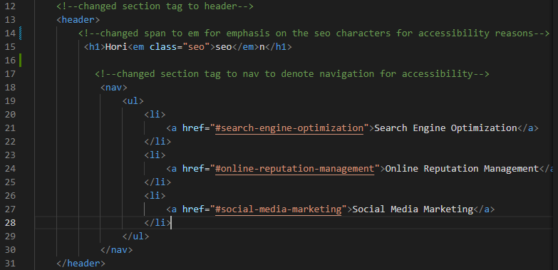

# Site-Refactoring-For-Horiseon-Landing-Page

## Technology Used 

| Technology Used         | Resource URL           | 
| ------------- |:-------------:| 
| HTML    | [https://developer.mozilla.org/en-US/docs/Web/HTML](https://developer.mozilla.org/en-US/docs/Web/HTML) | 
| CSS     | [https://developer.mozilla.org/en-US/docs/Web/CSS](https://developer.mozilla.org/en-US/docs/Web/CSS)      |   
| Git | [https://git-scm.com/](https://git-scm.com/)     |  

## Description 

[Visit the Deployed Site](https://dchung13.github.io/Site-Refractoring/)

This repository is where I refactored an existing website to adhere to the accessibility standards for use by all individuals. This includes rewriting the HTML code to use semantic HTML elements and rewriting and reorganizing the CSS code to be consolidated and more user friendly.  


## Table of Contents

* [Code Refactor Example](#code-refactor-example)
* [Installation](#installation)
* [Usage](#usage)
* [Learning Points](#learning-points)
* [Author Info](#author-info)
* [Credits](#credits)
* [License](#license)

## Code Refactor Example

This is an example of the code that was provided before refactoring.
```html
<div class="header">
        <h1>Hori<span class="seo">seo</span>n</h1>
        <div>
            <ul>
                <li>
                    <a href="#search-engine-optimization">Search Engine Optimization</a>
                </li>
                <li>
                    <a href="#online-reputation-management">Online Reputation Management</a>
                </li>
                <li>
                    <a href="#social-media-marketing">Social Media Marketing</a>
                </li>
            </ul>
        </div>
    </div>
```
The above code was changed by converting div tag, which is considered non-semantic as it does not provide any information, to the semantic element of header. Additionally the nav tag was included to indicate that the links would navigate to their appropriate sections on the webstie.
```html
 <!--changed section tag to header-->
    <header>
        <!--changed span to em for emphasis on the seo characters for accessibility reasons-->
         <h1>Hori<em class="seo">seo</em>n</h1>

           <!--changed section tag to nav to denote navigation for accessibility-->
            <nav>
                <ul>
                    <li>
                        <a href="#search-engine-optimization">Search Engine Optimization</a>
                    </li>
                    <li>
                        <a href="#online-reputation-management">Online Reputation Management</a>
                    </li>
                    <li>
                        <a href="#social-media-marketing">Social Media Marketing</a>
                    </li>
                </ul>
            </nav>
    </header>
```
Additionally, after changing the div tag to a header, the corresponding CSS had to be changed as well. This was changed from the following:

```css
.header {
    padding: 20px;
    font-family: 'Trebuchet MS', 'Lucida Sans Unicode', 'Lucida Grande', 'Lucida Sans', Arial, sans-serif;
    background-color: #2a607c;
    color: #ffffff;
}
```
This is the refactored code:

```css
header {
    padding: 20px;
    font-family: 'Trebuchet MS', 'Lucida Sans Unicode', 'Lucida Grande', 'Lucida Sans', Arial, sans-serif;
    background-color: #2a607c;
    color: #ffffff;
    position: fixed;
    width: 100%;
}
```

## Installation
This installation guide is to be used when creating changes to the code or making personal edits for any projects.

[1]. Access the repository from my github [GitHub Repository](https://github.com/dchung13/Site-Refractoring).
[2]. Copy the SSH key from the repository.
[3]. Clone the repository to your computer.
[4]. Open the repository on your computer.
[5]. Access the code through your IDE.

## Usage 

Added accessibility tags for the images and restructured the style sheet to consolidate similar sections together.

```md

```

Here is a screenshot of the changed header that was fixed to the top of the screen, added an emphasis to the seo section of Horiseon, and ensured the header links were visible and working.
```md

```

```md

```
The navigation links lead to the individual sections as shown below:
```md

```

## Learning Points

Research was conducted on semantic HTML language and the elements to be used when creating an accessible website. These are the resources that were used to incorporate those elements into refactoring a website.

[1]. [W3 HTML Semantics](https://www.w3schools.com/html/html5_semantic_elements.asp) I learned about semantic HTML language through the use of the W3 HTML Semantics site, including what tags should be avoided and which to be used when given accessibility standards.
[2]. [MDN HTML Semantics](https://developer.mozilla.org/en-US/docs/Glossary/Semantics) I researched more about which tags to use to add semantic elements for HTML.

Accessibility standards for websites was also researched to ensure the site refactoring adhere to those guidelines. This resource was used to research the accessibility standards.

[3]. [Accessibility Standards](https://www.ada.gov/resources/web-guidance/) I researched and learned about accessibility standards for websites.

## Author Info

```md
### David Chung


* [Portfolio](#) Coming Soon!
* [LinkedIn](https://www.linkedin.com/in/david-chung-77141526b/)
* [Github](https://github.com/dchung13/)
```

## Credits

[1]. Bryan Nguyen 

## License

MIT License

Copyright (c) [2023] [David Chung]

Permission is hereby granted, free of charge, to any person obtaining a copy
of this software and associated documentation files (the "Software"), to deal
in the Software without restriction, including without limitation the rights
to use, copy, modify, merge, publish, distribute, sublicense, and/or sell
copies of the Software, and to permit persons to whom the Software is
furnished to do so, subject to the following conditions:

The above copyright notice and this permission notice shall be included in all
copies or substantial portions of the Software.

THE SOFTWARE IS PROVIDED "AS IS", WITHOUT WARRANTY OF ANY KIND, EXPRESS OR
IMPLIED, INCLUDING BUT NOT LIMITED TO THE WARRANTIES OF MERCHANTABILITY,
FITNESS FOR A PARTICULAR PURPOSE AND NONINFRINGEMENT. IN NO EVENT SHALL THE
AUTHORS OR COPYRIGHT HOLDERS BE LIABLE FOR ANY CLAIM, DAMAGES OR OTHER
LIABILITY, WHETHER IN AN ACTION OF CONTRACT, TORT OR OTHERWISE, ARISING FROM,
OUT OF OR IN CONNECTION WITH THE SOFTWARE OR THE USE OR OTHER DEALINGS IN THE
SOFTWARE.
